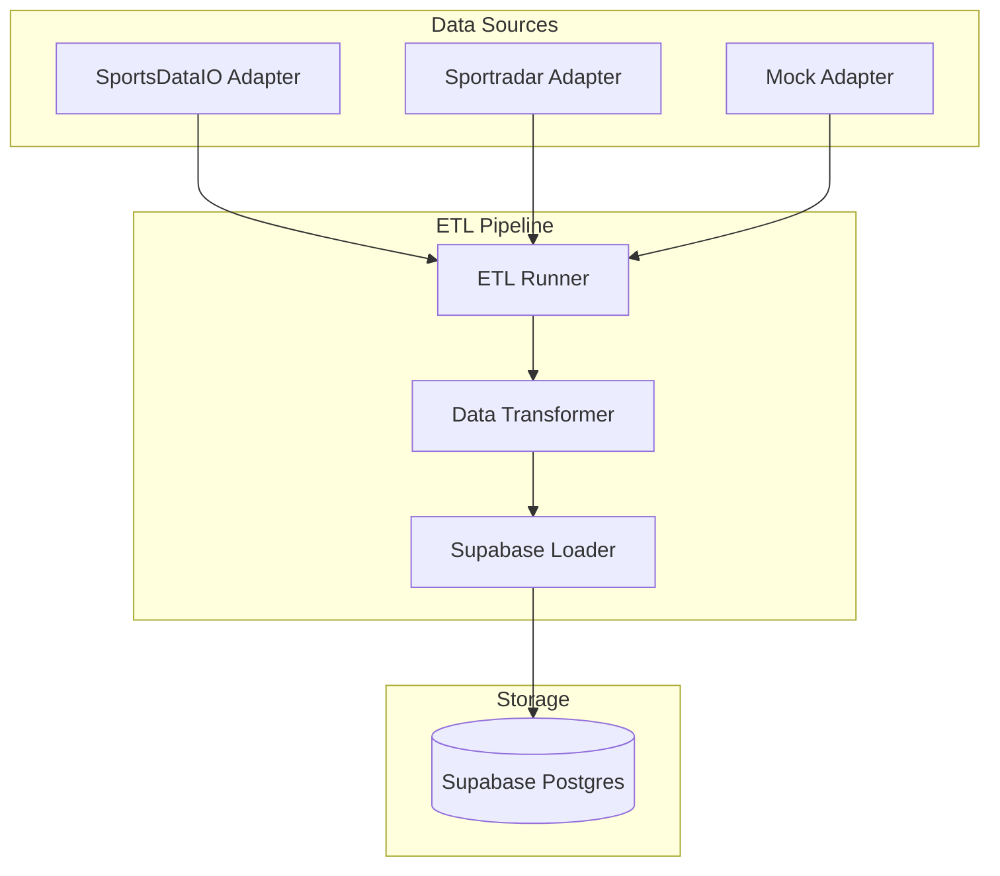

# ETL Pipeline for NFL Stats Ingestion

## Architecture Overview



The pipeline follows a **plugin-based adapter pattern** where each data source implements a standard interface. The runner discovers and executes adapters dynamically, making it trivial to add new sources.---

## 1. Database Schema Design

Create Supabase tables that align with your existing TypeScript types in [`src/lib/types.ts`](src/lib/types.ts):**Tables:**

### `players`

Core player identity - immutable attributes only.| Column | Type | Notes ||--------|------|-------|| id | text | Primary key (slug like "patrick-mahomes") || name | text | Full player name || position | text | QB, RB, WR, TE || image_url | text | Nullable || created_at | timestamptz | || updated_at | timestamptz | |

### `player_seasons`

Season-specific snapshot of player state. Handles team changes, jersey changes, and inactive seasons.| Column | Type | Notes ||--------|------|-------|| id | uuid | Primary key || player_id | text | FK to players || season | integer | e.g., 2024 || team | text | NFL team abbreviation for this season || jersey_number | integer | Jersey number for this season || is_active | boolean | Whether player was active this season || created_at | timestamptz | || updated_at | timestamptz | |**Unique constraint:** `(player_id, season)` for upserts

### `weekly_stats`

All stat columns default to 0. Unused stats for a position simply remain 0.| Column | Type | Notes ||--------|------|-------|| id | uuid | Primary key || player_season_id | uuid | FK to player_seasons || week | integer | 1-18 || opponent | text | Team abbreviation || location | text | "H" or "A" || result | text | "W 24-17" format || passing_yards | integer | Default 0 || passing_tds | integer | Default 0 || interceptions | integer | Default 0 || completions | integer | Default 0 || attempts | integer | Default 0 || rushing_yards | integer | Default 0 || rushing_tds | integer | Default 0 || carries | integer | Default 0 || receiving_yards | integer | Default 0 || receiving_tds | integer | Default 0 || receptions | integer | Default 0 || targets | integer | Default 0 || created_at | timestamptz | || updated_at | timestamptz | |**Unique constraint:** `(player_season_id, week)` for upserts

### `etl_runs`

| Column | Type | Notes ||--------|------|-------|| id | uuid | Primary key || adapter_name | text | Which data source || started_at | timestamptz | || completed_at | timestamptz | Nullable || status | text | "running", "success", "failed" || records_processed | integer | || error_message | text | Nullable |**Key design decisions:**

- **Season snapshots via `player_seasons`** - tracks team/jersey per season, handles trades and inactive years
- Explicit columns for every stat (no JSONB) - unused stats default to 0
- `weekly_stats` references `player_seasons` (not `players` directly) for proper historical context
- Composite unique constraints to enable upserts
- Indexes on frequently queried columns (player_id, season, week)

---

## 2. Adapter Interface

Define a standard contract in [`src/etl/adapters/base.ts`](src/etl/adapters/base.ts) that all data sources must implement:

```typescript
interface DataSourceAdapter {
  readonly name: string;
  readonly version: string;

  // Required methods every adapter must implement
  fetchPlayers(): Promise<RawPlayer[]>;
  fetchWeeklyStats(season: number, week?: number): Promise<RawWeeklyStat[]>;
  fetchSeasonSummary(season: number): Promise<RawSeasonSummary[]>;

  // Health check for the data source
  healthCheck(): Promise<boolean>;
}
```

Each adapter transforms external API responses into a normalized `Raw*` format that the pipeline then maps to your database schema.---

## 3. ETL Runner

Create a runner in [`src/etl/runner.ts`](src/etl/runner.ts) that:

1. Discovers registered adapters from [`src/etl/adapters/index.ts`](src/etl/adapters/index.ts)
2. Executes the standard adapter methods in sequence
3. Transforms raw data to database format
4. Upserts to Supabase with conflict handling
5. Logs run metadata for auditing

The runner is environment-agnostic - it exports a `runETL()` function that can be invoked from:

- Supabase Edge Function
- Vercel API route with cron
- Standalone Node.js script

---

## 4. File Structure

```javascript
src/etl/
├── adapters/
│   ├── base.ts          # Interface + types
│   ├── index.ts         # Adapter registry
│   └── mock.adapter.ts  # Reference implementation
├── transformers/
│   └── stats.ts         # Raw -> DB transformations
├── loaders/
│   └── supabase.ts      # Database upsert logic
├── runner.ts            # Main orchestrator
└── types.ts             # ETL-specific types
```

---

## 5. Supabase Client Setup

Add Supabase client configuration in [`src/lib/supabase.ts`](src/lib/supabase.ts) with:

- Server-side client for ETL operations
- Type-safe database queries using generated types

---

## 6. Entrypoints

Create flexible entrypoints for different execution environments:

- [`src/app/api/etl/route.ts`](src/app/api/etl/route.ts) - Next.js API route (for Vercel Cron)
- [`scripts/run-etl.ts`](scripts/run-etl.ts) - Standalone script for local/manual runs

---