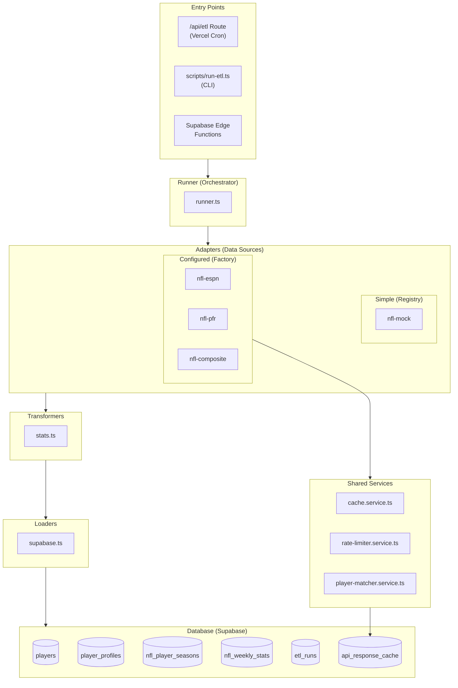
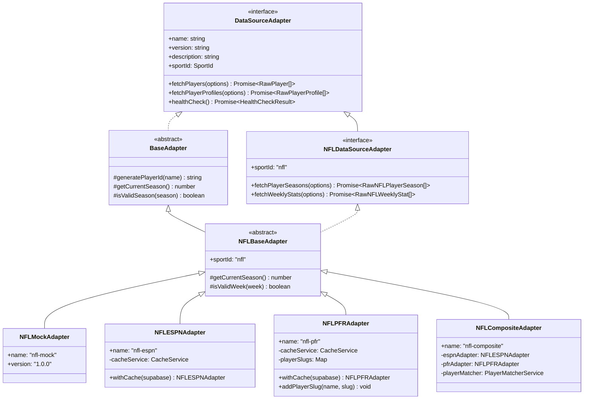
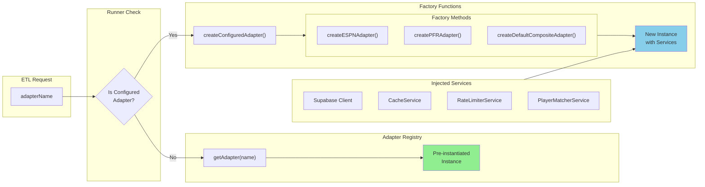
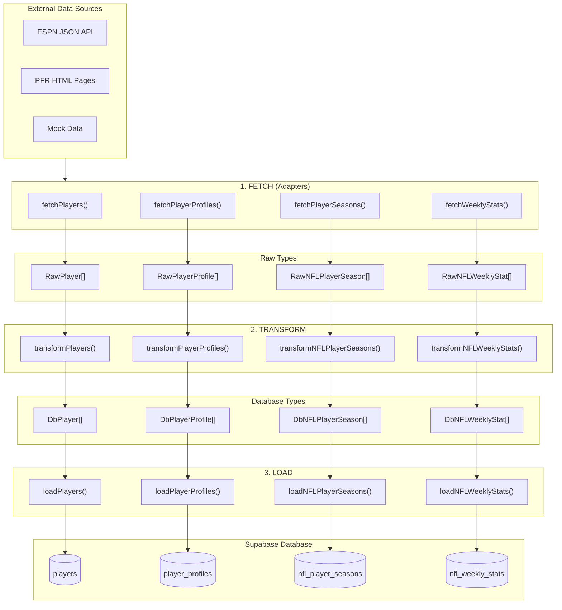
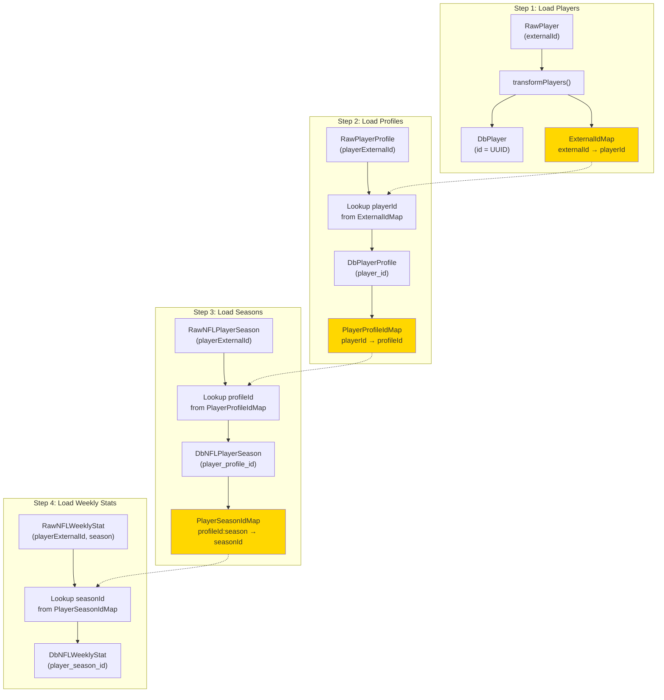
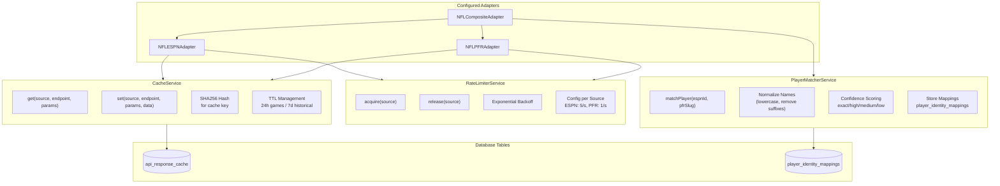
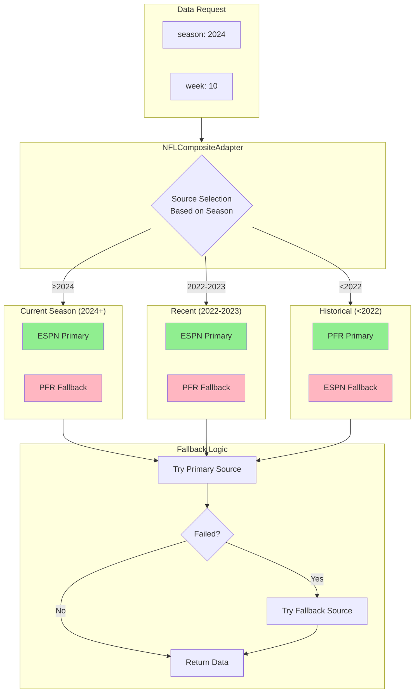
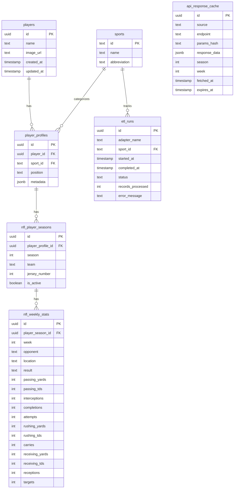

# ETL Pipeline Architecture

This document provides visual diagrams of the ETL pipeline architecture using Mermaid.

---

## High-Level Overview



---

## Adapter Pattern Detail



---

## Two-Tier Adapter Instantiation



---

## Data Flow Pipeline



---

## ID Mapping Flow



---

## Services Architecture



---

## Composite Adapter Strategy



---

## Database Schema (NFL)



---

## File Structure

```
src/etl/
├── adapters/                      # Data source implementations
│   ├── base.ts                    # Interface definitions & base classes
│   ├── index.ts                   # Registry + factory functions
│   ├── nfl-mock.adapter.ts        # Mock data (simple)
│   ├── nfl-espn.adapter.ts        # ESPN JSON API (configured)
│   ├── nfl-pfr.adapter.ts         # PFR scraping (configured)
│   └── nfl-composite.adapter.ts   # Multi-source orchestrator (configured)
│
├── services/                      # Shared services
│   ├── index.ts                   # Service exports
│   ├── cache.service.ts           # Response caching (Postgres)
│   ├── rate-limiter.service.ts    # Per-source rate limiting
│   └── player-matcher.service.ts  # Cross-source identity matching
│
├── transformers/                  # Raw → DB format conversion
│   └── stats.ts                   # Multi-sport transformers
│
├── loaders/                       # Database operations
│   └── supabase.ts                # Supabase upsert operations
│
├── runner.ts                      # Main orchestrator
├── types.ts                       # ETL-specific types
└── ARCHITECTURE.md                # This file
```

---

*Last updated: December 2024*

